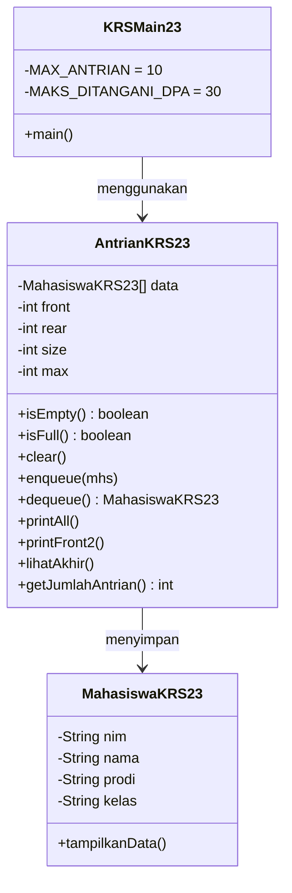

# Jawaban Jobsheet 10 (Queue) – Presensi 23

## Percobaan 1 – Operasi Dasar Queue

### 2.1.3 Pertanyaan

1) **Pada konstruktor, mengapa `front` dan `rear` bernilai `-1`, sedangkan `size` bernilai `0`?**  
- `front = rear = -1` menandakan **queue belum punya elemen** (belum ada indeks valid).  
- `size = 0` menandakan **jumlah elemen saat ini** memang masih nol.  
- Setelah enqueue pertama, barulah `front` dan `rear` menjadi `0`.

2) **Pada method `enqueue`, maksud/kegunaan potongan kode pengaturan `rear` dan penyimpanan data**  
Intinya untuk menambah elemen di belakang (FIFO) dan menjaga indeks tetap valid (circular queue):  
- Kalau queue kosong: `front = rear = 0`  
- Kalau tidak kosong: `rear` digeser ke indeks berikutnya (circular) lalu `data[rear] = dt`  
Implementasi yang dipakai ada di `Pertemuan10/P1Jobsheet10/Queue23.java` (method `enqueue`).

3) **Pada method `dequeue`, maksud/kegunaan potongan kode pengaturan `front` dan kondisi saat queue menjadi kosong**  
Intinya untuk mengeluarkan elemen di depan dan menggeser `front`:  
- Ambil `dt = data[front]`  
- Kurangi `size`  
- Jika setelah dikurangi queue kosong: set `front = rear = -1`  
- Jika tidak: `front` digeser ke indeks berikutnya (circular)  
Implementasi ada di `Pertemuan10/P1Jobsheet10/Queue23.java` (method `dequeue`).

4) **Pada method `print`, mengapa perulangan dimulai dari `i = front`, bukan `i = 0`?**  
Karena elemen queue yang “aktif” dimulai dari posisi `front`.  
Di circular queue, data bisa tersebar, jadi mencetak dari `0` tidak selalu mewakili urutan antrian.

5) **Maksud potongan kode pergeseran indeks saat print (circular)**  
Bagian seperti `i = (i + 1) % max` berfungsi agar indeks:  
- maju ke elemen berikutnya, dan  
- kembali ke `0` jika sudah mencapai `max-1`.

6) **Potongan kode yang merupakan queue overflow**  
Overflow terjadi saat enqueue ketika queue penuh:
- `if (isFull()) { ... }` pada `Pertemuan10/P1Jobsheet10/Queue23.java` method `enqueue`.

7) **Modifikasi agar overflow/underflow menghentikan program**  
Modifikasi yang dilakukan:
- **File yang dimodifikasi:** `Pertemuan10/P1Jobsheet10/Queue23.java`  
- **Kode yang ditambahkan/diubah:** pada kondisi overflow di `enqueue()` dan underflow di `dequeue()` ditambahkan:
  - `System.out.println("Program dihentikan.");`
  - `System.exit(1);`

## Percobaan 2 – Antrian Layanan Akademik

### 2.2.3 Pertanyaan

**Tambah method `lihatAkhir()` di `AntrianLayanan` + tambah menu (opsi 6) agar bisa dipanggil**

Modifikasi yang dilakukan:
- **File yang dimodifikasi:** `Pertemuan10/P2Jobsheet10/AntrianLayanan23.java`
  - Menambahkan method `lihatAkhir()` untuk menampilkan data pada posisi `rear` (antrian paling belakang).
- **File yang dimodifikasi:** `Pertemuan10/P2Jobsheet10/LayananAkademikSIAKAD23.java`
  - Menambahkan menu `6. Cek Antrian Paling Belakang`
  - Pada `switch-case`, menambahkan `case 6: antrian.lihatAkhir();`

## Tugas – Antrian Persetujuan KRS oleh DPA

### Class Diagram (Markdown)

### Implementasi fitur tugas (mapping ke code)
- Cek kosong/penuh/clear: `AntrianKRS23.isEmpty()`, `AntrianKRS23.isFull()`, `AntrianKRS23.clear()` di `Pertemuan10/TugasKRS/AntrianKRS23.java`
- Tambah antrian (daftar mahasiswa): menu `1` di `Pertemuan10/TugasKRS/KRSMain23.java`
- Panggil 2 mahasiswa per proses KRS: menu `2` di `Pertemuan10/TugasKRS/KRSMain23.java` (loop 2x dequeue)
- Tampilkan semua / 2 terdepan / paling akhir: menu `3/4/5` memanggil `printAll()`, `printFront2()`, `lihatAkhir()`
- Cetak jumlah antrian: menu `9` (`getJumlahAntrian()`)
- Cetak jumlah yang sudah proses KRS: menu `10` (variabel `sudahProses`)
- Cetak jumlah yang belum proses KRS (kuota 30): menu `11` (`30 - sudahProses`)

