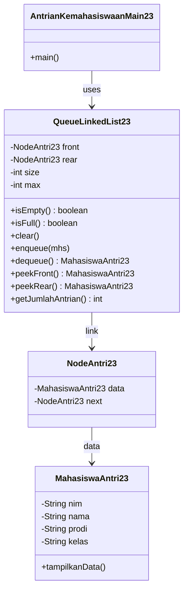

# Jawaban Jobsheet 11 (Linked List) – Presensi 23

## Percobaan 1 – Pembuatan Single Linked List

### 2.1.2 Pertanyaan

1) **Mengapa baris pertama menampilkan “Linked List Kosong”?**  
Karena pada awal program, linked list masih belum berisi node (`head == null`). Saat `print()` dipanggil, `isEmpty()` bernilai `true`, sehingga program menampilkan teks **“Linked List Kosong”**.

2) **Jelaskan kegunaan variabel `temp/tmp` secara umum pada setiap method!**  
`temp/tmp` digunakan sebagai **pointer sementara** untuk:
- melakukan traversal (menelusuri node dari `head` sampai `null`),
- mencari node tertentu (misalnya node dengan `nim` tertentu),
- berhenti di node sebelum target (misalnya saat insert/remove),  
tanpa mengubah referensi `head`/`tail`.

3) **Modifikasi agar data dapat ditambahkan dari keyboard**  
Modifikasi dilakukan dengan menambahkan input `Scanner` pada class main, lalu membaca data mahasiswa dan memanggil `addLast()` (atau method tambah lain).

**Kode yang dimodifikasi (jawaban diminta menyebutkan perubahan):**
- **File:** `Pertemuan11/SLLMain23.java`
  - Ditambahkan `Scanner sc` + helper `inputMahasiswa()` untuk input dari keyboard
  - Ditambahkan blok:
    - “Input 1 data mahasiswa dari keyboard …”
    - `singLL.addLast(mhsInput);`

## Percobaan 2 – Modifikasi Elemen pada Single Linked List

### 2.2.3 Pertanyaan

1) **Mengapa digunakan keyword `break` pada fungsi `remove`?**  
`break` dipakai untuk **menghentikan traversal setelah node yang dicari berhasil dihapus**.  
Tanpa `break`, perulangan akan terus berjalan dan berpotensi:
- menghapus lebih dari satu node (jika ada NIM yang sama),
- atau menyebabkan logika traversal menjadi tidak konsisten setelah pointer `next` diubah.

2) **Jelaskan kegunaan kode berikut pada method `remove`**

Potongan kode (sesuai implementasi di `remove()`):
```java
tmp.next = tmp.next.next;
if (tmp.next == null) {
    tail = tmp;
}
break;
```

Penjelasan:
- `tmp.next = tmp.next.next;` → **melewati (skip) node yang dihapus**, sehingga node tersebut tidak lagi terhubung di linked list.
- `if (tmp.next == null) tail = tmp;` → jika node yang dihapus adalah **tail lama**, maka `tail` harus dipindah ke node sebelumnya (`tmp`).
- `break;` → berhenti karena penghapusan sudah selesai.

**Kode yang dimodifikasi (jawaban diminta menyebutkan perubahan):**
- Percobaan 2 membutuhkan penambahan method akses/hapus. Implementasi ada di:
  - **File:** `Pertemuan11/SingleLinkedList23.java`
    - ditambahkan: `getData(int)`, `indexOf(String)`, `removeFirst()`, `removeLast()`, `remove(String)`, `removeAt(int)`
  - **File:** `Pertemuan11/SLLMain23.java`
    - ditambahkan pemanggilan method-method di atas untuk uji akses & hapus.

## Tugas – Antrian Layanan Unit Kemahasiswaan (Queue berbasis Linked List)

### Class Diagram (Markdown)



### Implementasi tugas (mapping ke code)
- **Project baru (bukan modifikasi percobaan):** package `Pertemuan11.TugasAntrianKemahasiswaan`
- Daftar mahasiswa saat mau antri: menu `1` di `Pertemuan11/TugasAntrianKemahasiswaan/AntrianKemahasiswaanMain23.java`
- Cek kosong/penuh/clear: `QueueLinkedList23.isEmpty()`, `QueueLinkedList23.isFull()`, `QueueLinkedList23.clear()`
- Menambah antrian: `QueueLinkedList23.enqueue()`
- Memanggil antrian: `QueueLinkedList23.dequeue()`
- Lihat terdepan & paling akhir: `QueueLinkedList23.peekFront()`, `QueueLinkedList23.peekRear()`
- Jumlah yang masih mengantre: `QueueLinkedList23.getJumlahAntrian()`

